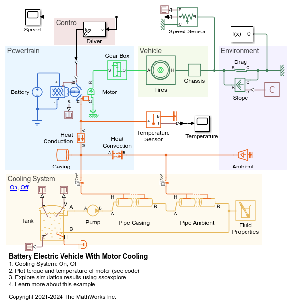
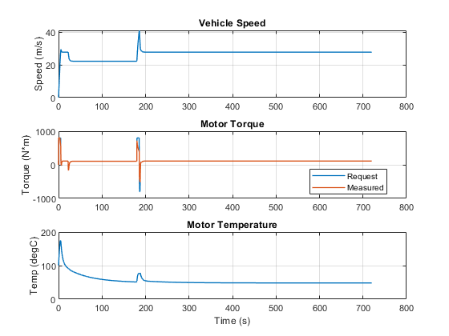

# **Battery Electric Vehicle Model With Motor Cooling in Simscape**
Copyright 2021 The MathWorks, Inc.

This example models a battery electric vehicle with a cooling system for
the motor.  It is used to size mechanical, electrical, and fluid
components in the vehicle.  The vehicle executes a passing maneuver and
the speed, torque, and temperature measurements are used to assess if the
system requirements are met.

To learn more about modeling and simulation with Simscape, please visit:
* [Simscape Getting Started Resources](https://www.mathworks.com/solutions/physical-modeling/resources.html)
* Product Capabilities:
   * [Simscape](https://www.mathworks.com/products/simscape.html)
   * [Simscape Driveline](https://www.mathworks.com/products/simscape-driveline.html)
   * [Simscape Electrical](https://www.mathworks.com/products/simscape-electrical.html)
   * [Simscape Fluids](https://www.mathworks.com/products/simscape-fluids.html)
   * [Simscape Multibody](https://www.mathworks.com/products/simscape-multibody.html)

